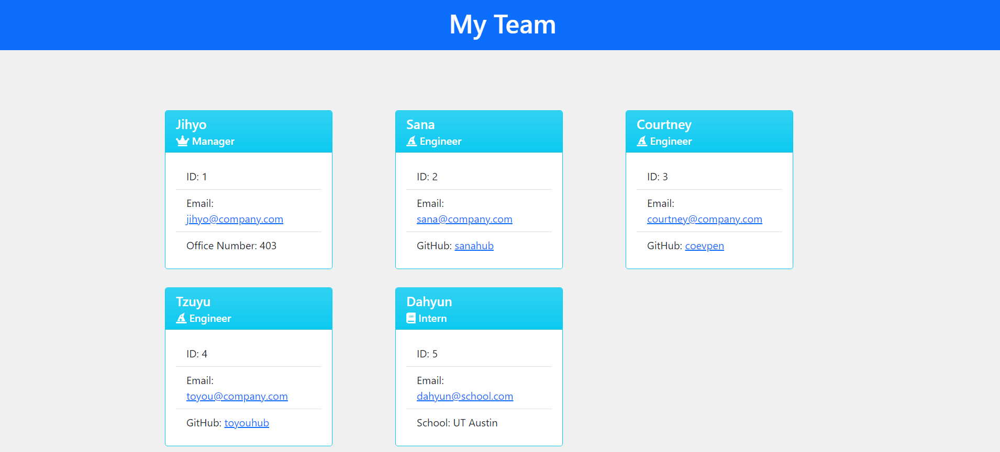

# My Team Roster
  ## Description
  This program prompts the user for information about their team members (from Manager, to Engineer and Intern) and generates an html webpage with the information.

  ## Built With
  * Javascript
  * HTML/CSS
  * npm inquirer
  * jest
  * Nodejs

  ## Video Walkthrough
  [Walkthrough Link](https://watch.screencastify.com/v/QmwbPbgsI7VF4Vhj2sHa)

  ## Webpage Screenshot
  

  ## Installation
  To install necessary dependencies, run the following command:

  ```npm install inquirer```

  ## Testing

  ```npm install jest --save-dev```
  
  change the test value to 'jest' in package.json

  ```npm test```